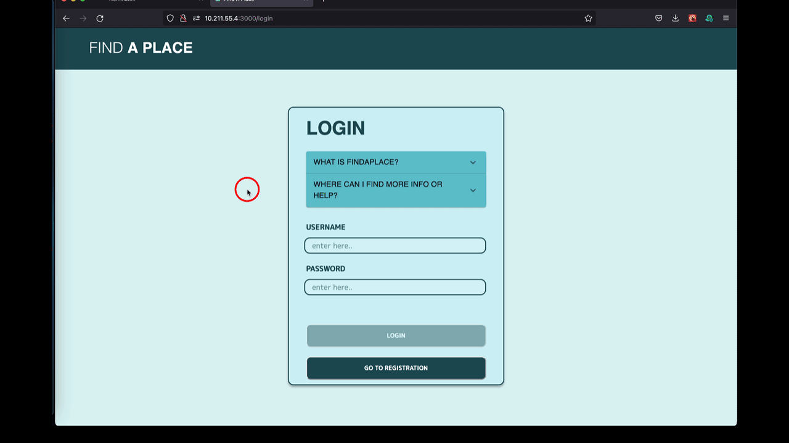
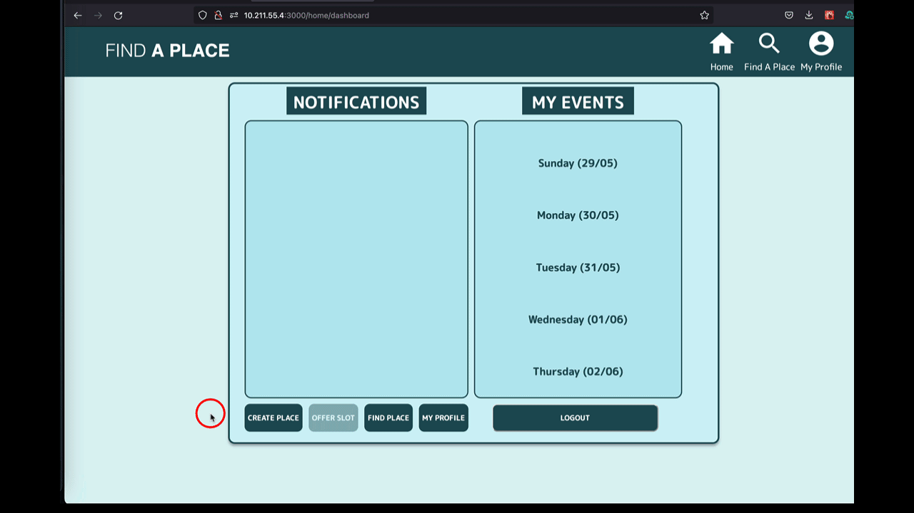
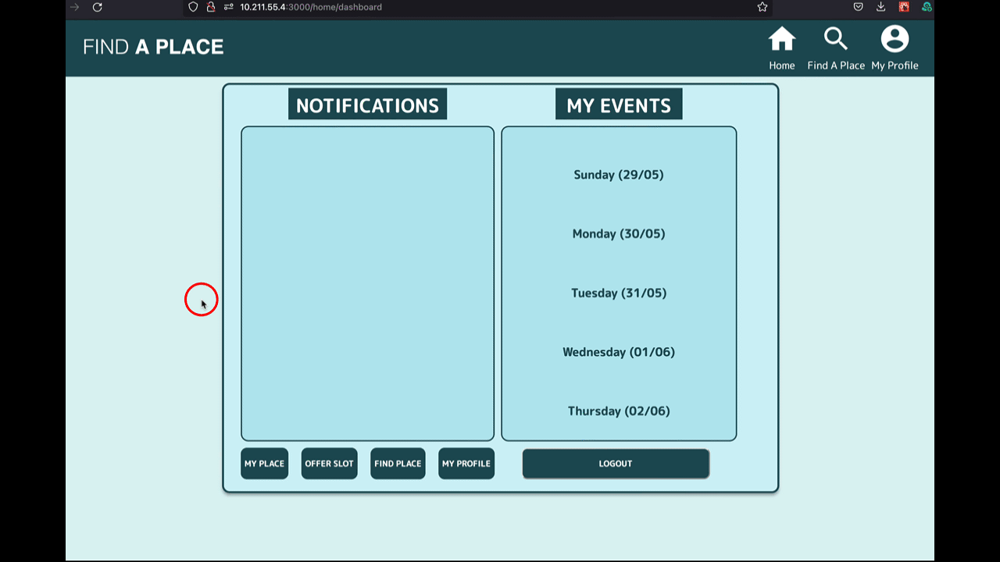
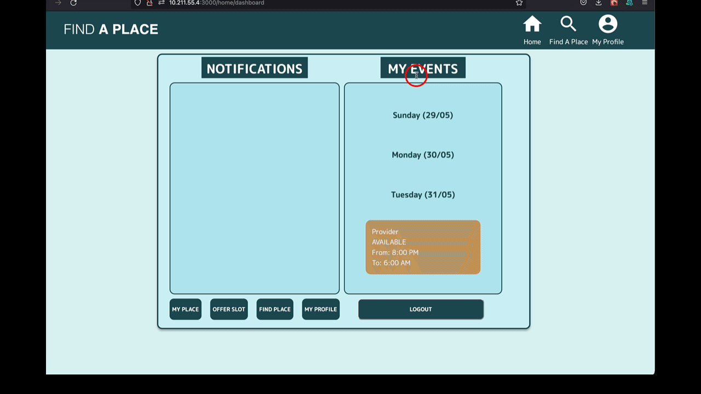
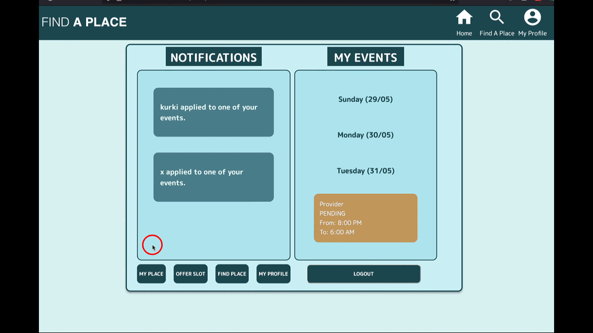
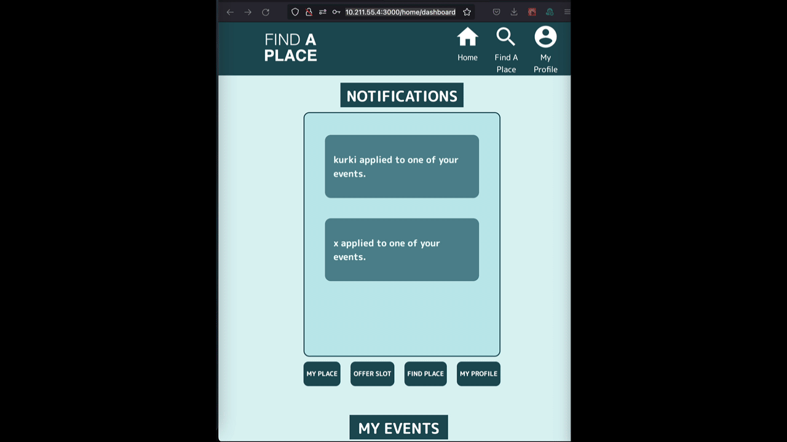

# SoPra FS22 - Group 02

[](https://sonarcloud.io/project/overview?id=sopra-fs22-group-02_client)
[](https://sonarcloud.io/project/overview?id=sopra-fs22-group-02_client)

## FindAPlace (Frontend)

### Introduction
**FindAPlace** is a location-centric event-planner that allows students to quickly and easily find a place to sleep. Whether it is about taking a quick nap, or just crashing at a place to sleep after a long night of studying or partying. **FindAPlace** has you covered!

Places for sleeping are offered by other users. These places can then be chosen when searching for a suitable time slot and location. A simple accept / reject mechanism allows the place provider to then simply choose which applicant will get the place for the desired time.

After being accepted, you or the provider of the place can start a real-time Q&A session where you can ask each other your important questions about the stay.

### Technologies

#### **User** **technologies**
This app is written in React with HTML / CSS and JS. To offer users a unique and augmented experience we - among others - rely on the following technologies:
- [MUI](https://mui.com/) for icons, some UI elements
- [MomentJS](https://momentjs.com/) for easily ensuring interoperability of time formats
- [Lodash](https://lodash.com/) for handling and wrangling data more easily
- [React Time Picker](https://www.npmjs.com/package/react-time-picker) to enable user friendly datetime selection
- [StompJS Client](https://www.npmjs.com/package/@stomp/stompjs) to allow Websocket connections in the QnA Session with backend
- [React Table](https://www.npmjs.com/package/react-table) to structure QnA session responses tabularly

#### **Dev** **technologies**
To develop efficiently we rely on:

- [MirageJS](https://miragejs.com/) for simulating backend responses (pre-implementation)
- [FakerJS](https://fakerjs.dev/) for generating mock data for the factories of Mirage
- [ESLint](https://eslint.org/) for linting errors before execution

### APIs
We also implement the following external APIs:
- [Firebase](https://firebase.google.com/) to store and retrieve uploaded images
- [Nominatim API](https://nominatim.org/) to resolve addresses and provide a link of the location on OpenStreetMap

### Main Components

The FindAPlace Frontend relies on the following primary components:

- [Login](https://github.com/sopra-fs22-group-02/client/blob/master/src/components/views/Login.js) & [Registration](https://github.com/sopra-fs22-group-02/client/blob/master/src/components/views/Registration.js)
    - In these components we allow users to get a first `Description` of what **FindAPlace** is and also provide Login and Registration capabilities.
- [Home](https://github.com/sopra-fs22-group-02/client/blob/master/src/components/views/Home.js) (including [Calendar](https://github.com/sopra-fs22-group-02/client/blob/master/src/components/views/Calendar.js))
    - Upon successful registration the user is greeted with a `Dashboard`. In the dashboard they can see notifications and also a Calendar. The notifications reveal what happened recently: E.g., if the user is invited to a `QnASession` or if they were accepted or another user has applied to an event they offer. The `Calendar` shows all `SleepEvents` the user has applied for or is offering. The user also has the ability to concede with creating a `Place` so they can offer `SleepEvents` (which other users can then apply for).
- [Find Place](https://github.com/sopra-fs22-group-02/client/blob/master/src/components/views/FindPlace.js)
  - A user can explore `Places` of other users and the events other users are offering by selecting `FindAPlace` from the home screen. The user can explore places via `Faceted Search`, by selecting which Campus the place should be closest to. They then can `browse` through the places and seek a offered `SleepEvent` that maches their desired time.
- [Event Management]() (including [Event Creation]())
  - Once a fitting event has been selected, the user has the ability to apply to the event. This will start the application process. The providing user (`Provider`) is notified of the new applying user (`Applicant`) and by clicking the `Notification` (which will appear without a refresh in `Home`), the user is brought to an provider side view, where they can select the appropriate candidate.
- [QnASession](https://github.com/sopra-fs22-group-02/client/blob/master/src/components/views/QnA.js)
    - The `QnA` session allows to interact with an `Accepted Applicant` or a `Provider` depending on the role you have in a Sleep Event. The answer you provide are not stored on the server. You can ask and answer a set of pre-defined Yes/No/Skip questions. The technology employed to enable this turn-based real-time communication is Websockets.
- **Fundamental** **Entities**: [Profile Editing](https://github.com/sopra-fs22-group-02/client/blob/master/src/components/views/ProfileEdit.js), [Place Registration](https://github.com/sopra-fs22-group-02/client/blob/master/src/components/views/PlaceRegister.js),
[Place Editing](https://github.com/sopra-fs22-group-02/client/blob/master/src/components/views/PlaceProfileEdit.js)
    - In these components users have the ability to register or edit data, such as setting a picture for themselves or for their places. They can also write a description for their place, set an address. Analogously they can set a biography for themselves. 

### Launch & Deployment
This repository can be cloned or forked on Github. NPM is used to manage dependencies.

#### Install
```
./npm install
```
To look for any missing dependencies and if there are missing ones they will be installed
#### Run
```
./npm run dev
```
Runs the app in the development mode. It should open the webpage automatically otherwise you can find it under: [http:localhost:3000](http://localhost:3000). 
If you apply edits the page will automatically reload.
#### Test
```
./npm run test
```
Launches the test runner in the interactive watch mode.
See the section about [running tests](https://create-react-app.dev/docs/running-tests/) for more information.
#### Build
```
./npm run test
```
Builds the app for production to the build folder. It's now ready to be deployed. See the section about [deployment](https://create-react-app.dev/docs/deployment/) for more information.

#### VM-based development & hot-reloading

The basis for the project is create-react-app. If you use FS mounted storage (from the host system mounted into the VM) and execute the code in a virtual machine or docker container it can become a problem for changes of the code made in the host system to cause an automatic recompile of the dev processes running in the VM. A possibility here is to use [nodemon](https://nodemon.io/) to enable watch-polling instead of inotify-based reload trigger.

### FAQ (with Illustrations)
<details>
<summary>How do I register for FindAPlace?</summary>



</details>

<details>

<summary>How do I create my place?</summary>



</details>

<details>

<summary>How do I offer my place?</summary>





</details>

<details>
    
<summary>How do I Find A Place to sleep and apply for the place?</summary>
    

    
</details>

<details>
    
<summary>How can I see applicants of my Sleep Event?</summary>
    

    
</details>

<details>
    
<summary>How do I accept a QnA Session?</summary>
    

    
</details>

<details>
    
<summary>How do I create a QnA Session?</summary>
    

    
</details>

<details>
    
<summary>Why can't I ask my own questions in the QnA Session?</summary>
    
> Depending on your `Role` (provider or applicant) in the event you can only choose from a predefined set of questions. The intent here is to keep dialogues safe and reduced to essentials. You are welcome to add some additional contact information in your biography (such as an Email address) to discuss further details with your `Applicant` / `Provider`. The QnA session can be a safe-space for initial interaction however.

    
</details>

<details>
    
<summary>Why does the QnASession stop if a user has not joined and I refreshed the page?</summary>
    
>For privacy reasons we do not intend to offer any persistence of users answered or asked questions. This implies this data is only stored on the clients computers. If the data is not on a joined peers computer, the data is lost. Therefore we encourage you not to refresh page while waiting for another user to join. If another user has joined and is in the session you can refresh the page, as they will pass the data to you again.
    
</details>

<details>
    
<summary>Why can I only offer and find Sleep Events for 7 days in advance?</summary>
    
> The philosophy of FindAPlace is to allow for serendipity and spontenaety. Since the idea is P2P sharing without cost, we do not want to encourage fully planned out or right out Booking of places. This can be found on other platforms such as Couchsurfing or Airbnb.
    
</details>


### Roadmap
- Expand filtering capabilities to enable true Exploratory Search.
- Expand towards a better authentication (JWT) and integrate with [backend](https://github.com/sopra-fs22-group-02/server).
- Rewrite UI using a UI Framework like [Patternfly](https://www.patternfly.org/v4/).
- Write Automated Tests for the Frontend using a framework like [Cypress](https://www.cypress.io/).
- Feel free to propose and discuss additional ideas to us by submitting a Github Issue.

Long-shot mission: Expand to multiple universities (multiple campus)


## Authors and acknowledgment
### Backend
- Marco Thoma
- Johanna Bieri // Group Leader

### Frontend
- Paul Safari
- Dylan Massey
- Yufeng Xiao

### Further Acknowledgment
- Samuel Brügger // TA
- Roy Rutishauser // Assistant
- Thomas Fritz, Prof. Dr.

### License
This project is licensed under the MIT License - see the ([LICENSE.md](https://github.com/sopra-fs22-group-02/server/blob/master/LICENSE.md)) file for details 
